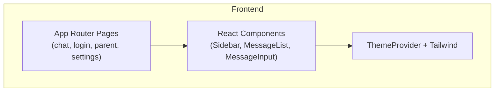
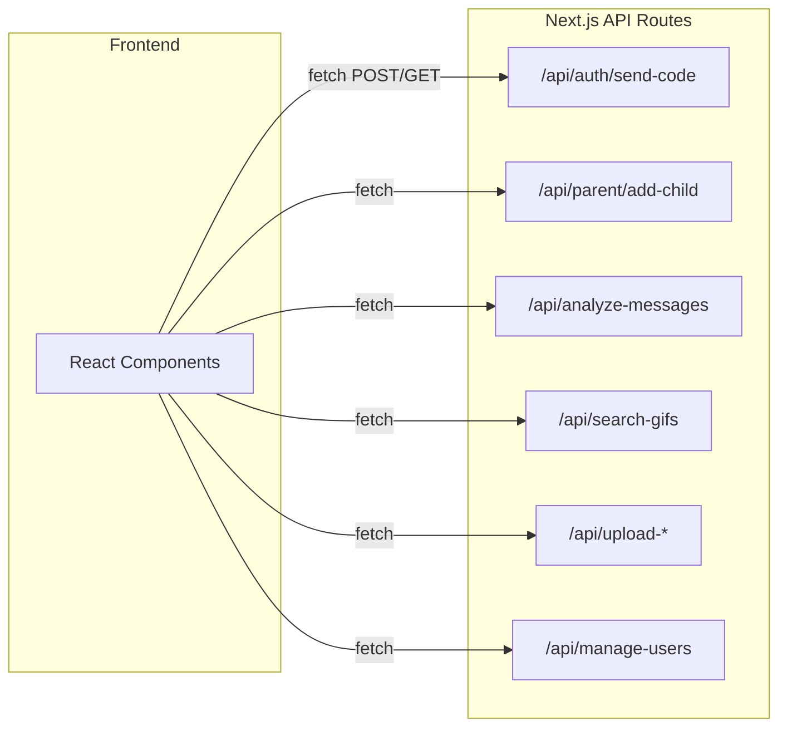
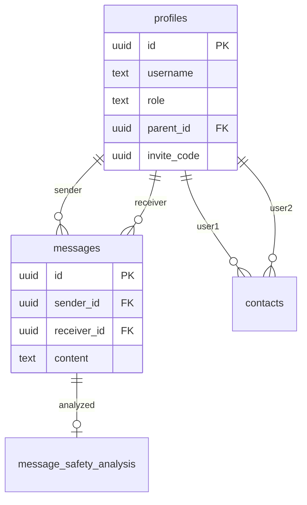
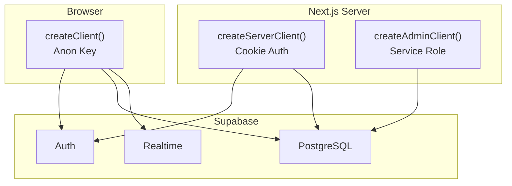
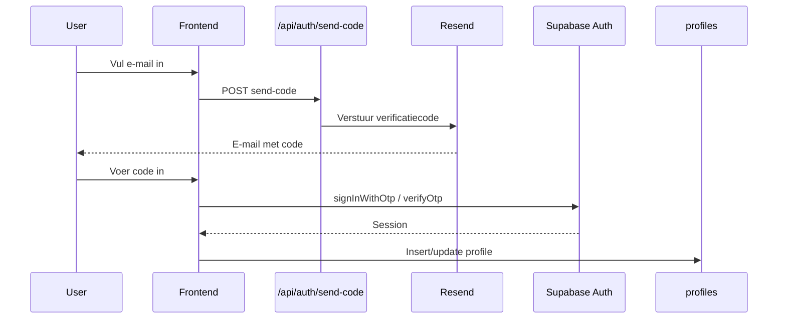
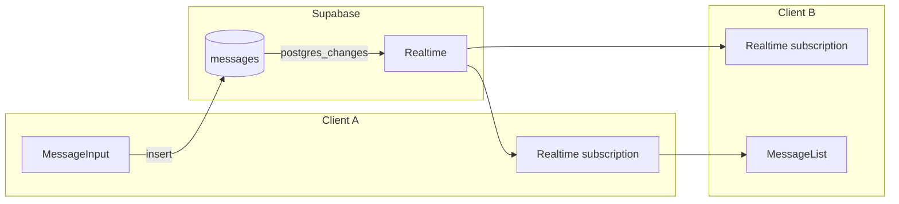
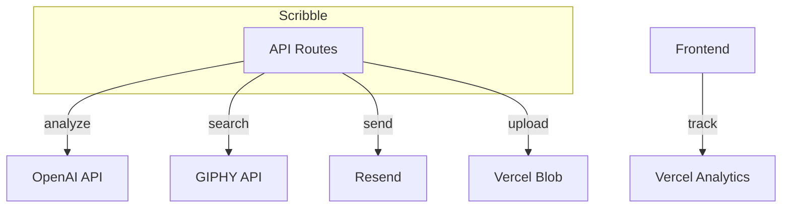
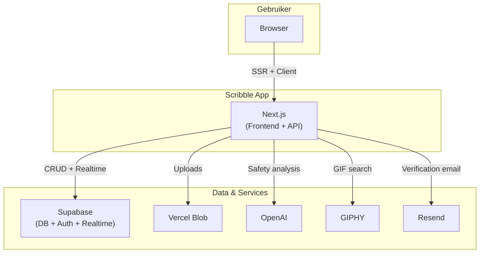

# Technisch overzicht – Scribble

Dit document beschrijft hoe alle componenten in de Scribble-applicatie samenwerken: welke technologieën worden gebruikt, hoe de database met de frontend communiceert, en hoe de onderdelen zich tot elkaar verhouden.

---

## 1. Frontend (Next.js + React)

De frontend is gebouwd met Next.js 14 (App Router) en React 18. Alle pagina's draaien als client-side React-componenten. Styling gebeurt met Tailwind CSS en het thema (licht/donker) wordt beheerd via een ThemeProvider.

**Technologieën:** Next.js 14.2, React 18, TypeScript 5.7, Tailwind CSS 3.4, emoji-picker-react



---

## 2. Backend (Next.js API Routes)

Er is geen aparte backend-server. De backend bestaat uit Next.js API Routes in `app/api/`. Deze routes draaien server-side en worden aangeroepen via `fetch()` vanuit de frontend. Elke route handelt authenticatie af via de Supabase server client (cookies).

**Technologieën:** Next.js API Routes, Supabase Server Client



---

## 3. Database (Supabase / PostgreSQL)

De database is PostgreSQL via Supabase. Er zijn vier hoofdtabellen: `profiles` (gebruikers), `messages` (chatberichten), `contacts` (contacten tussen gebruikers) en `message_safety_analysis` (AI-veiligheidsanalyses). Row Level Security (RLS) bepaalt wie welke rijen mag lezen/schrijven.

**Technologieën:** Supabase, PostgreSQL, RLS



---

## 4. Supabase-clients (verbinding met de database)

Er zijn drie manieren om met Supabase te praten:

1. **Browser client** (`lib/supabase.ts`) – voor client components: auth, CRUD, realtime. Gebruikt anon key.
2. **Server client** (`lib/supabase-server.ts` – `createServerClient`) – voor API routes: cookie-based auth, respecteert RLS.
3. **Admin client** (`createAdminClient`) – voor beheer (bijv. kind-accounts aanmaken): service role key, bypassed RLS.



---

## 5. Authenticatie (Supabase Auth)

Inloggen en registreren gebeurt via Supabase Auth. Na succesvolle auth wordt een profiel in `profiles` aangemaakt of bijgewerkt. De sessie wordt beheerd via cookies (SSR) of via de browser client. E-mailverificatie gebruikt Resend via `/api/auth/send-code`.

**Technologieën:** Supabase Auth, Resend (e-mail)



---

## 6. Chat & realtime (Supabase Realtime)

Berichten worden direct naar de `messages`-tabel geschreven via de Supabase client. Er zijn geen eigen WebSockets: realtime updates komen van Supabase Realtime via `postgres_changes` op `messages` en `contacts`. Zodra een nieuw bericht wordt toegevoegd, krijgen alle geabonneerde clients een update.

**Technologieën:** Supabase Realtime, PostgreSQL LISTEN/NOTIFY



---

## 7. Bestandsupload (Vercel Blob)

Profielfoto’s en afbeeldingen in berichten gaan via Next.js API routes naar Vercel Blob. De API valideert bestandstype en -grootte, uploadt naar Blob en retourneert een publieke URL. Die URL wordt in de database opgeslagen.

**Technologieën:** Vercel Blob, Next.js API Routes

```mermaid
flowchart LR
    User["User"] -->|FormData| API["/api/upload-*"]
    API -->|put()| Blob["Vercel Blob"]
    Blob -->|url| API
    API -->|url| User
    User -->|url in content| Supabase["Supabase DB"]
```

---

## 8. Externe services

| Service | Doel | Aanroep |
|---------|------|---------|
| **OpenAI** | Veiligheidsanalyse van berichten voor ouders | `/api/analyze-messages` |
| **GIPHY** | GIF-zoekfunctie (G-rated) | `/api/search-gifs` |
| **Resend** | Verificatie-e-mails | `/api/auth/send-code` |
| **Vercel Analytics** | Gebruiksstatistieken | Frontend |



---

## 9. End-to-end dataflow

Overzicht van de belangrijkste flows:



---

## 10. Environment variables

| Variabele | Doel |
|-----------|------|
| `NEXT_PUBLIC_SUPABASE_URL` | Supabase project URL |
| `NEXT_PUBLIC_SUPABASE_ANON_KEY` | Publieke client key |
| `SUPABASE_SERVICE_ROLE_KEY` | Admin-operaties (server-only) |
| `OPENAI_API_KEY` | Berichtveiligheidsanalyse |
| `RESEND_API_KEY` | E-mailverificatie |
| `GIPHY_API_KEY` | GIF-zoekfunctie |
| `BLOB_READ_WRITE_TOKEN` | Vercel Blob uploads |
